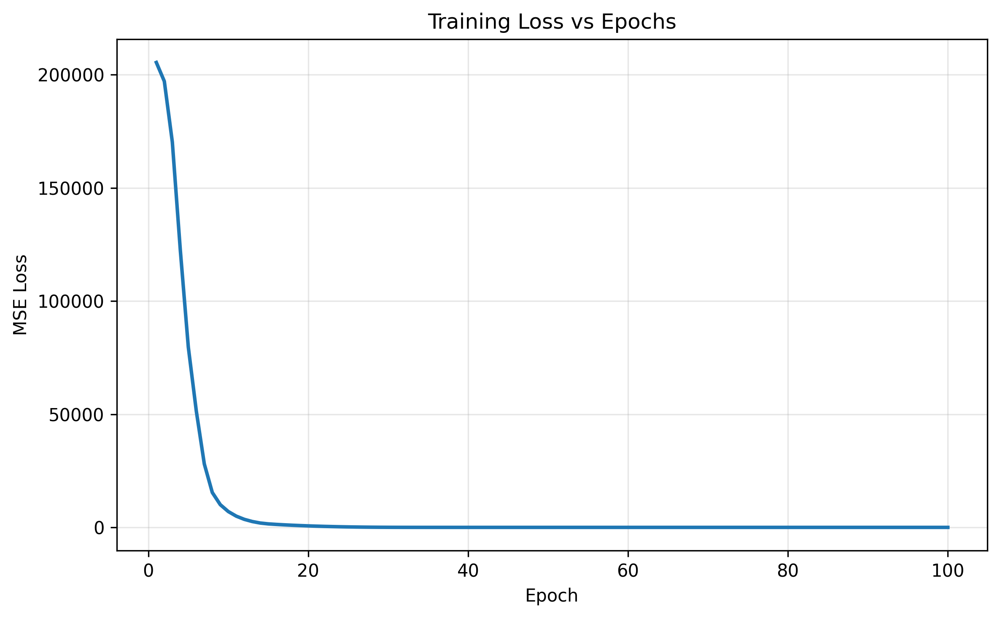
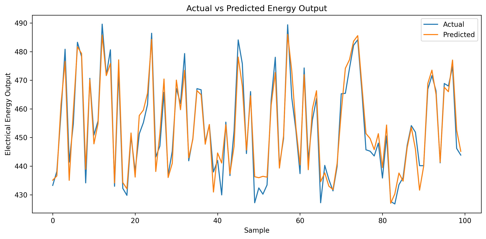

# Power Plant Energy Prediction using Artificial Neural Networks

  <b>Predicting electrical energy output of a Combined Cycle Power Plant using a PyTorch-based Artificial Neural Network.</b>

  
  

---

## Overview

Accurate prediction of electrical energy output is essential for efficient power plant operation and energy management. Environmental conditions such as temperature, ambient pressure, humidity, and exhaust vacuum significantly influence the amount of electricity generated by a combined cycle power plant.

This project develops an **Artificial Neural Network (ANN)** using **PyTorch** to predict the net hourly electrical energy output based on environmental measurements. The workflow includes data preprocessing, feature scaling, neural network training, model evaluation, and performance analysis.

---

## Problem Statement

The objective of this project is to predict the **net hourly electrical energy output (PE)** of a Combined Cycle Power Plant using four environmental variables:

- Ambient Temperature (AT)
- Exhaust Vacuum (V)
- Ambient Pressure (AP)
- Relative Humidity (RH)

The model aims to learn the relationship between these operating conditions and power generation to provide accurate energy output predictions.

---

## Dataset Summary

| Property | Value |
|----------|-------|
| Dataset | Combined Cycle Power Plant Dataset |
| Features | 4 |
| Target Variable | PE (Net Hourly Electrical Energy Output) |
| Problem Type | Regression |

---

## Approach

The project follows a complete deep learning workflow:

- Data preprocessing
- Feature scaling using StandardScaler
- Train-test split
- Artificial Neural Network development using PyTorch
- Model training using Mean Squared Error Loss
- Performance evaluation using MSE Loss and R² Score

---

## Data Preprocessing

Before training the model:

- Missing values were checked and handled.
- Input features were separated from the target variable.
- Data was divided into training and testing sets.
- Features were standardized using **StandardScaler** to improve training stability.
- Data was converted into PyTorch tensors for model training.

---

## Model Architecture

The neural network consists of:

| Layer | Configuration |
|--------|---------------|
| Input Layer | 4 Neurons |
| Hidden Layer 1 | 6 Neurons + ReLU |
| Hidden Layer 2 | 6 Neurons + ReLU |
| Output Layer | 1 Neuron |

The model was trained using the **Adam Optimizer** with **Mean Squared Error (MSE) Loss**.

---

## Results

The trained ANN achieved the following performance on the dataset.

| Metric | Training | Testing | Inference |
|--------|---------:|---------:|-----------|
| MSE Loss | **20.04** | **18.39** | Low prediction error indicating effective learning. |
| R² Score | **0.9315** | **0.9357** | Strong predictive performance with good generalization. |

The testing R² score of **93.57%** demonstrates that the model successfully captures the relationship between environmental variables and electrical energy output.

---

## Model Architecture

---

## Training Loss

  

<i>Training loss across epochs showing model convergence.</i>

---

## Actual vs Predicted Values

  

<i>Comparison between actual and predicted electrical energy output.</i>

---

## Tech Stack

- Python
- PyTorch
- Pandas
- NumPy
- Matplotlib
- Scikit-learn
- Jupyter Notebook

---
